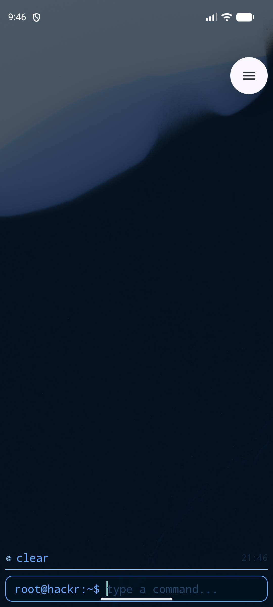
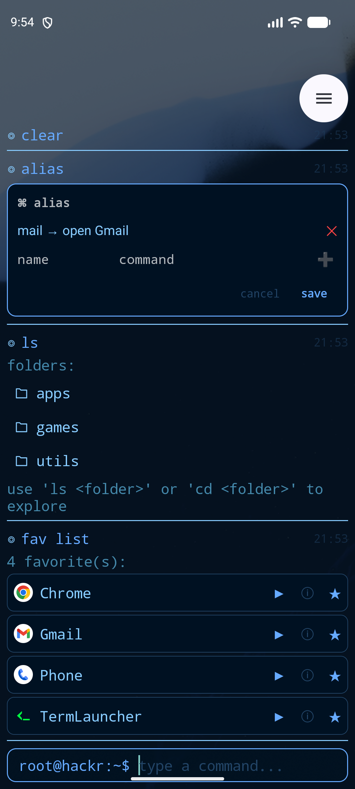
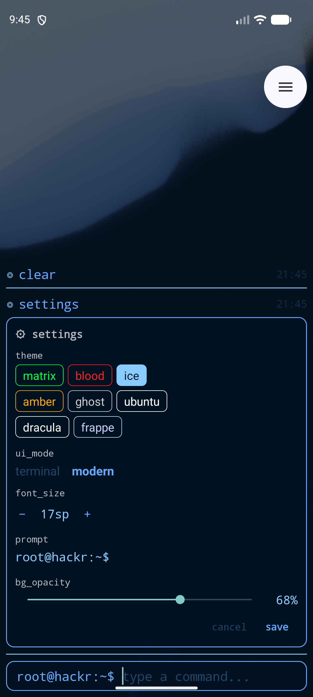
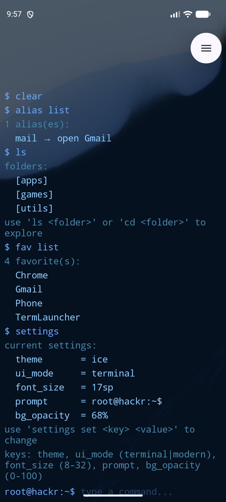

# TermLauncher

Your Android home screen, reimagined as a command line.

No icon grid. No widgets. No app drawer to swipe through. You unlock your phone, a prompt is waiting for you, and you type what you want — `open spotify`, `ls music`, `fav add camera`. That's the whole interface.

<p align="center">
  
  
  
  
</p>
<p align="center"><i>Modern mode (default) — home screen, aliases/folders/favorites, and the interactive settings panel — next to terminal mode's plain-text look.</i></p>

---

## What it feels like

Everything you'd expect from a home screen is still here — it's just faster to get to, and it looks like a hacker's terminal while you do it:

- **Launch apps by typing their name** — `open spotify` fuzzy-matches, so you don't need to spell it exactly
- **Organize apps into folders** you navigate like a filesystem — `ls`, `cd music`, `mv apps/Spotify music/`
- **Favorite your most-used apps** so they're matched first
- **Create shortcuts (aliases)** for anything — `alias br "open brave"` and `br` launches Brave from then on
- **8 built-in color themes** — matrix, blood, ice, amber, ghost, ubuntu, dracula, frappe — plus a customizable prompt string
- **Two looks, your choice** — a clean **modern** interface by default, or a stripped-down **terminal** mode for purists (more on this below)

Everything you set up — theme, folders, favorites, aliases, font size — is saved and survives restarts.

---

## Installation

TermLauncher is a sideload build — not yet on the Play Store.

1. Download the latest `app-debug.apk` from the [Releases](https://github.com/adelapazborrero/term_launcher/releases) page
2. On your Android device, enable **Install unknown apps** for your file manager
3. Open the APK and tap **Install**
4. Press the **Home button** — Android will ask which launcher to use; choose **TermLauncher**

> Requires Android 8.0 (API 26) or later.

---

## Getting Started

The first time you open TermLauncher, type `help` to see what's available. A few to try right away:

```
help              — list all commands
apps              — show all installed apps
open spotify      — launch Spotify (partial name match works)
themes            — list available themes
settings set theme dracula
```

By default you're in **modern mode** — rounded input bar, colored status dots, timestamps, and tappable app cards. If you'd rather have a bare, distraction-free prompt with nothing but text, that's **terminal mode**, built for people who want the launcher to disappear into pure keyboard-driven muscle memory:

```
settings set ui_mode terminal
```

You can switch back any time with `settings set ui_mode modern`, or open `settings` as an interactive panel in modern mode to flip it with a tap.

---

## Command Reference

Every command supports `-h` for quick usage info (e.g. `mv -h`).

### Apps & Launching

| Command | Description |
|---|---|
| `open <name>` | Launch an app by name — partial match works |
| `apps` | List all installed apps |
| `apps -f <query>` | Filter the app list by name |
| `find <name>` | Search installed apps (same as `apps -f`) |

### Folders

Organize apps into named folders, just like directories.

| Command | Description |
|---|---|
| `ls` | Show all folders (including the built-in `[apps]` folder) |
| `ls <folder>` | Show apps inside a folder |
| `ls apps` | Show all uncategorized apps |
| `cd <folder>` | Navigate into a folder |
| `cd ..` | Return to root |
| `mkdir <name>` | Create a new folder |
| `mv <app> <folder>/` | Move an app into a folder |
| `mv <app> ..` | Remove an app from its folder |
| `mv apps/Spotify music/` | Move using folder paths |

### Favorites

Favorites are checked first when using `open`, so your most-used apps launch faster.

| Command | Description |
|---|---|
| `fav add <name>` | Add an app to favorites |
| `fav remove <name>` | Remove from favorites |
| `fav list` | Show all favorites |

### Aliases

```
alias br "open brave"     — now typing 'br' launches Brave
alias list                — show all aliases
alias remove br           — remove an alias
```

Quotes are required when the expansion contains spaces.

### Settings

```
settings list                        — show all current settings
settings set theme <name>            — switch theme
settings set ui_mode modern          — modern look with indicators + timestamps (default)
settings set ui_mode terminal        — bare, classic terminal look
settings set font_size 16            — text size in sp (8–32)
settings set prompt "hack@r:~$ "     — custom prompt string
settings set bg_opacity 80           — let your wallpaper show through (0–100)
settings reset                       — restore all defaults
```

### Themes

| Name | Look |
|---|---|
| `matrix` | Black background, green text |
| `blood` | Dark red background, bright red text |
| `ice` | Dark blue background, light blue text |
| `amber` | Dark background, amber/orange text |
| `ghost` | Near-black background, white/grey text |
| `ubuntu` | Aubergine background, Ubuntu-orange accents |
| `dracula` | The classic Dracula editor palette |
| `frappe` | Catppuccin Frappé — soft pastel-on-slate |

### Other

| Command | Description |
|---|---|
| `help` | Bullet list of all commands |
| `help -l` | Verbose help with descriptions |
| `themes` | List available themes |
| `info` | Device info (model, Android version, battery, time) |
| `clear` | Clear the terminal output |

---

## UI Modes

**Modern mode** (default) — the same command-driven interface with visual upgrades:
- Rounded border on the input bar
- App results (from `apps`, `ls`, `fav list`, etc.) render as cards with icon, name, and tap-to-launch/info/favorite buttons
- `settings` and `alias` open as interactive panels instead of plain text

**Terminal mode** — for hardcore users who want zero chrome: plain monospace text, `$` prefix on commands, no cards, no panels, no decorations. Everything above still works, it's just printed as text.

All colors follow the active theme in both modes — switching themes updates everything, indicators included.

---

## For Developers

Contributions are welcome. TermLauncher is a small, single-Activity Kotlin app with no external backend — it's a good project to hack on.

### Building from source

```bash
git clone https://github.com/adelapazborrero/term_launcher
cd term_launcher
./gradlew assembleDebug
# APK output: app/build/outputs/apk/debug/app-debug.apk
```

Requires Android Studio or the Android SDK with `ANDROID_HOME` set (or a `local.properties` with `sdk.dir`). Targets Android 8.0+ (API 26), compiled against API 35.

Other useful tasks:

```bash
./gradlew installDebug          # build + install on a connected device
./gradlew test                  # unit tests
./gradlew connectedAndroidTest  # instrumented tests on a device
./gradlew lint                  # lint checks
```

### Architecture at a glance

- **`LauncherActivity`** — the single Activity; hosts the output `RecyclerView` and the pinned input bar
- **`LauncherViewModel`** — owns all managers (apps, favorites, folders, aliases, settings, theme) and session state
- **`commands/`** — `CommandProcessor` tokenizes input and resolves aliases; `CommandRegistry` maps command names to `Command` implementations in `commands/impl/`
- **`apps/`** — `AppManager` wraps `PackageManager`; `FavoritesManager` and `FolderManager` persist app organization
- **`settings/`, `theme/`** — persisted, `StateFlow`-backed settings and theme state
- **`terminal/`** — `TerminalAdapter` renders entries in either UI mode; `TerminalEntry` is the data model for a single line/card/panel

See [`CLAUDE.md`](CLAUDE.md) for a full architectural deep-dive, including how commands are dispatched, how the folder system and UI-mode rendering work, and persistence details.

### Adding a new command

1. Create `commands/impl/MyCommand.kt` implementing the `Command` interface (a `description` string + an `execute` function)
2. Register it in `CommandRegistry`
3. `-h` support is automatic — no extra work needed

### Contributing

1. Fork the repo and create a branch for your change
2. Keep commands small and focused — one `Command` implementation per file
3. Run `./gradlew test lint` before opening a PR
4. Open a pull request describing what changed and why

Bug reports and feature ideas are welcome via [GitHub Issues](https://github.com/adelapazborrero/term_launcher/issues).

---

## License

[MIT](LICENSE)
